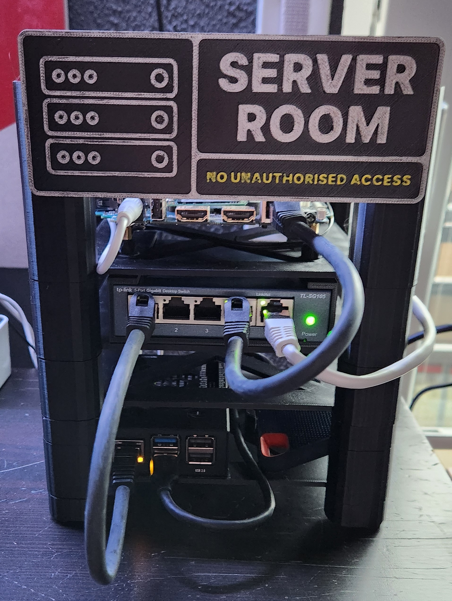

# HomeLab

## Overview
I always liked the idea to have some kind of server to play around with. Initially I bought a used HP Z600 Workstation with a single X5650 Xeon Processor. It ran Unraid and had two 250GB SSDs in it. I ran RepetierServer on it to control my Ender 3 V2 with Sprite Extruder and played around with other Linux Distros.
The Downside was the average power consumption of around 85W all the way up to 130W. That doesn't sound much, but with energy prices in Germany, it adds up.

So something had to change. I still had a mini PC laying around with a broken CPU cooler. So I decided to get rid of the plastic case, use thermalglue to attach a CPU cooler to it (since there was no standard mounting holes for regular CPU coolers) and solder the cooler fan to the 12V input of the mini pc. That gave me a descent X86 platform for my HomeLab idea with a power consumption of around 14W.

The second player for my HomeLab has to be a Raspberry Pi of course. So I decided on a Raspberry Pi 5.

To allow for a nice HomeLab package and future expandability, I designed and 3D printed a tower housing both "workstations" and the switch. This approach allows for future growth by just adding another layer to the stack.

## Hardware

##### Mini PC
- Intel J4125 CPU 4 Cores / 4 Threads, 2,0GHz Base / 2,7GHz Boost
- 8GB DDR4 RAM
- 256GB M.2 SSD
- Ubuntu Server 23.10
- Geekbench Score: Single Core: 358 / Multi Core : 1021

##### Raspberry Pi 5
- 2,4 GHz ARM Cortex-A76 Quad-Core
- 8 GB LPDDR4X-4267 SDRAM
- 500GB USB SSD
- Raspberry Pi OS Lite 64bit (based on Debian Bookworm)
- Geekbench Score: Single Core: 603 / Multi Core : 1608

## Docker Container

xmrig MoneroMiner Dockerfile

I wrote this Dockerfile and build the image on the raspberry pi and the x86 (due to architecture difference). This gave me the image needed to run a preconfigured xmrig instance, mining XMR for the moneroocean pool. Here you can find my <a href="https://github.com/JetDev22/homelab/xmrigContainer/Dockerfile">Dockerfile</a>

Glances

I run Glances to monitor each worker (Raspberry Pi and X86 mini PC). Here you can find <a href="https://github.com/joweisberg/docker-glances">Glances on Github</a>

Dashy

With glances installed, I use dashy to display all my servers in one convenient place (currently two). And since there was some space left, why not use it to track the latest crypto developments. I deployed dashy as docker container on my raspberry pi 5 using the following command.<ul><li>docker run -d -p 8080:80 -v ~/dashyconfig/my-conf.yml:/app/public/conf.yml --name HomeLab --restart=always lissy93/dashy:latest</li></ul>You can find my dashy config in this repositories files

## Power Consumption
Idle:  
Load: 23W resulting in around 0.562 kWh / day

## Plans

## STLs
