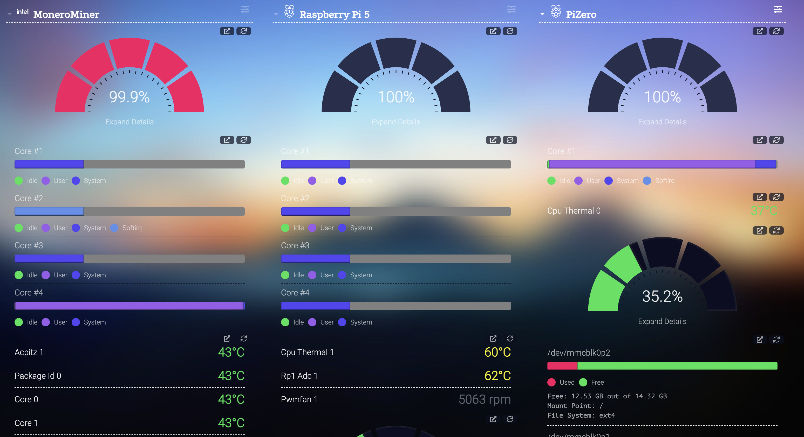

# HomeLab

## Overview
I started off with an old HP Z600 Workstation that had plenty of power, but even with just one X5650 installed power and noise was too much. So I changed to an old i7 4770 System that had a better power draw and noise level, but was still not the right setup for me, drawing 82W in idle.

Since I wanted to checkout the Raspberry Pi 5 anyways, had a spare Pi zero laying around, and gutted an old mini PC, I thought why not combine them all into my very own HomeLab Solution.

I designed my own rack system to allow for future expandability and brought my power draw under load to around 29W. The mini PC and my Raspberry Pi 5 are joined in a docker swarm, with the Pi beeing the master. The mini PC serves its last days as a monero miner. That is by no means efficient or lucrative, but hey we might as well just have him do something with a purpose. Last but not least I setup my Pico Pis that I had from other projects to mine som Duino Coin, help the network and have a fun introduction into clustering.

## Hardware

##### Mini PC
- Intel J4125 CPU 4 Cores / 4 Threads, 2,0GHz Base / 2,7GHz Boost
- 8 GB DDR4 RAM
- 256 GB M.2 SSD
- Ubuntu Server 23.10
- Geekbench Score: Single Core: 358 / Multi Core : 1021

##### Raspberry Pi 5
- 2,4 GHz ARM Cortex-A76 Quad-Core
- 8 GB LPDDR4X-4267 SDRAM
- 500GB USB SSD
- Raspberry Pi OS Lite 64bit (based on Debian Bookworm)
- Geekbench Score: Single Core: 603 / Multi Core : 1608

##### Raspberry Pi Zero W
- 1GHz BCM 2835 SOC
- 512 MB Ram
- 16 GB Micro SD Card
- Raspberry Pi OS Lite 32bit
- Geekbench Score: Single Core: 323

##### T-Display ESP32 1.14
- 240 MHz Xtensa Single- / Dual-Core-32-Bit-LX6
- 4 MB Flash
- Nerdminer V2

##### Raspberry Pi Pico
- 133 MHz Dual-Core Arm Cortex-M0+ Prozessor
- 264 KB Ram
- 2 MB Flash

## Docker Container

xmrig MoneroMiner Dockerfile [Mini PC, Raspberry Pi 5, Raspberry Pi Zero]

I wrote this Dockerfile and build the image on the raspberry pi and the x86 (due to architecture difference). This gave me the image needed to run a preconfigured xmrig instance, mining XMR for the moneroocean pool. Here you can find my <a href="https://github.com/JetDev22/homelab/xmrigContainer/Dockerfile">Dockerfile</a>. For my mini PC running the Intel J4125 I had to add --threads=4 to force all 4 cores to be used. The pi image works right out of the box on all cores

Glances [Mini PC, Raspberry Pi 5, Raspberry Pi Zero]<

I run Glances to monitor each worker (Raspberry Pi and X86 mini PC). Here you can find <a href="https://github.com/joweisberg/docker-glances">Glances on Github</a>

Dashy [Raspberry Pi 5]<

With glances installed, I use dashy to display all my servers in one convenient place (currently two). And since there was some space left, why not use it to track the latest crypto developments. I deployed dashy as docker container on my raspberry pi 5 using the following command.<ul><li>docker run -d -p 8080:80 -v ~/dashyconfig/my-conf.yml:/app/public/conf.yml --name HomeLab --restart=always lissy93/dashy:latest</li></ul>You can find my dashy config in this repositories files

Octoprint Docker [Raspberry Pi 5]

The Pi Zero manages my 8 Pico Pi cluster, mining Duco (Duino Coin) and mines Duco itself at the same time. You can find the Duino Project <a href="https://duinocoin.com/">here</a>

Duino Coin Miner [Raspberry Pi Zero]

 

This Octoprint Container manages my Ender 3V2 with SpriteExtruder. This way I can send my files from my laptop running OrcaSlicer straight to my Ender via wifi. You can find out more about Octoprint <a href="https://octoprint.org/">here</a>

## Power Consumption
Idle: [to be determined, they are just to busy working] 
Load: 29W resulting in around 0.696 kWh / day

## Plans
- Delpoy various projects to docker containers
- Host my website (A300 Reference)
- Get one or two more Pi 5s and replace the mini PC as worker

## STLs
All my *.stl files can be found over at printables.com by Prusa.<ul>
<li>The Mini Rack: <a href="https://www.printables.com/model/763694-modular-and-stackable-homelab-mini-rack">Here</a></li>
<li>The Pico Pi Mount: <a href="https://www.printables.com/model/765855-usb-cable-mount-for-pico-cluster">Here</a></li>
</ul>
